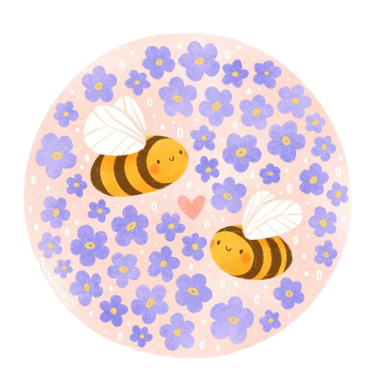
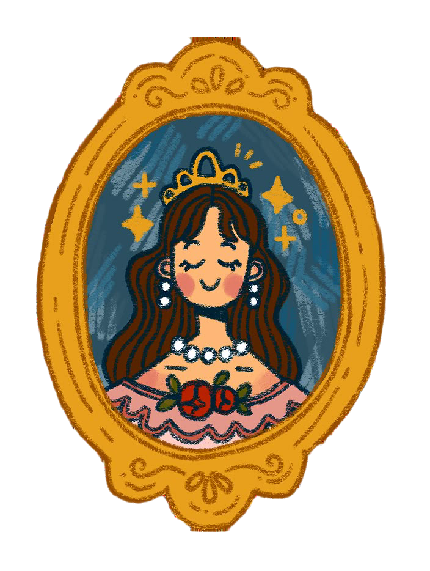

<!DOCTYPE html>
<html lang="en">
<head>
    <meta charset="UTF-8">
    <title>Jumana</title>
    <link rel="stylesheet" href="style.css">
    <link rel="icon" href="favicon (1).ico">
    <link rel="stylesheet" href="https://fonts.googleapis.com/css?family=Sofia">
    <link rel="preconnect" href="https://fonts.googleapis.com">
    <link rel="preconnect" href="https://fonts.gstatic.com" crossorigin>
    <link href="https://fonts.googleapis.com/css2?family=Sacramento&display=swap" rel="stylesheet">
</head>
<body>

    <h1 class="sacramento-regular">I'm Jumana</h1>
    
A Programmer & Data Science student.

    

        
        
    

    

        
        
        
    

    
<h1 class="other-h">About me</h1>

<table>
    <tr><td>
I'm currently studying Data Science 
</td><td></td></tr>
</table>
<table>
    <tr><td></td>
        <td>
And i also want to be a web developer
</td></tr>
</table>

    
 
    

   <h1 class="two">contact me</h1>
   
Email	"jumthaibi@gmail.com"

   
Mobile Number	"0786933907"

</body>
</html>

